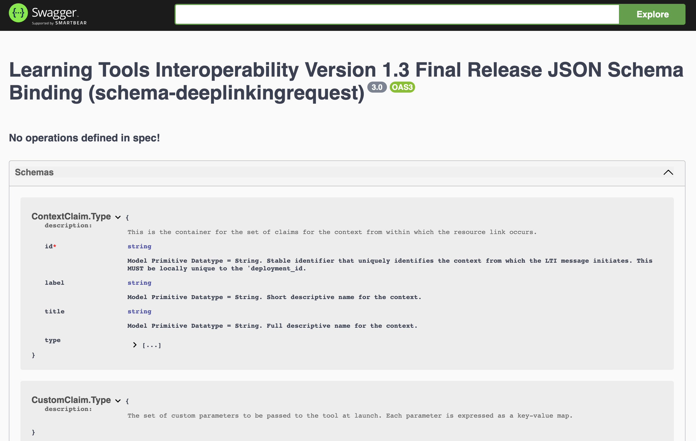
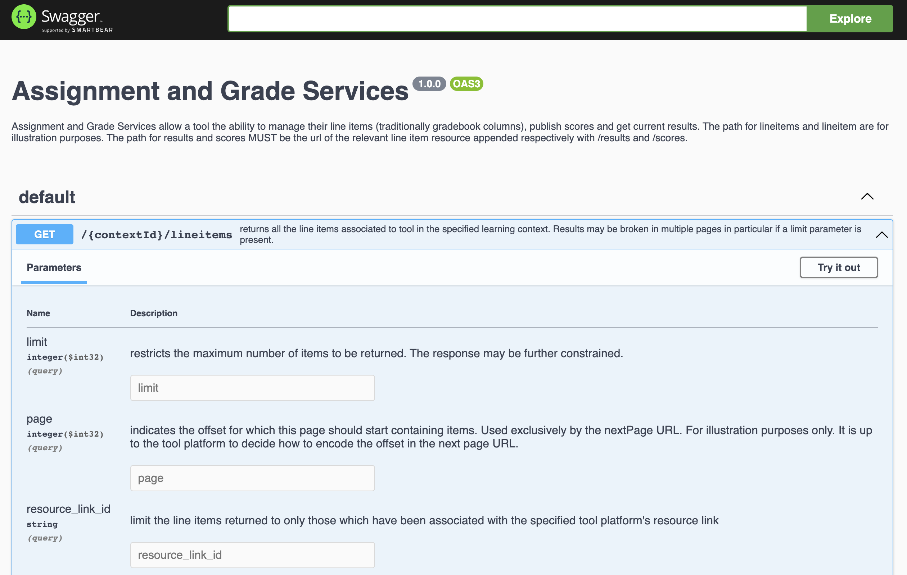

# IMS Types Example

## Introduction

This repository contains models (types) for the [Learning Tools Interoperability (LTI)](https://www.imsglobal.org/activity/learning-tools-interoperability) standard using the [specification provided by IMS](https://www.imsglobal.org/spec/lti/v1p3/#normative-documents). The generated code lives in the `lti` directory. 

LTI also includes an [Assignment and Grade Services (LTI-AGS)](https://www.imsglobal.org/spec/lti-ags/v2p0/) standard. However, the [provided OpenAPI specification](https://www.imsglobal.org/spec/lti-ags/v2p0/openapi/#/default) is invalid, so code generation is skipped.

## Motivation

1. Generate types for these so others don't have to.
2. Demonstrates that treating schemata and specifications as data creates a single source of truth that eliminates unnecessary (and dangerous) duplication and provides a better user and developer experience.

## Swagger UI

The Gradle build includes local [Swagger UI](https://swagger.io/tools/swagger-ui/) generation for the specifications. These are not included in the repository due to their size and complexity.





To view this UI locally, clone the repo and run the Gradle generate task inside of the repo.

```shell
./gradlew generate
```

If successful, you will be able to open the generated documentation at `lti/doc/index.html` and `assignment-and-grade-services/doc/index.html`.

